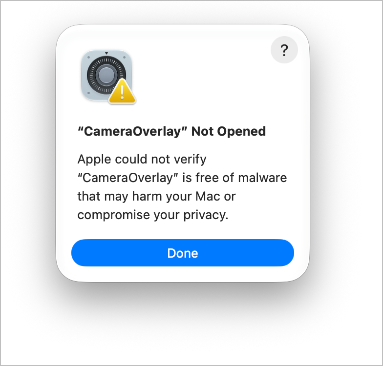
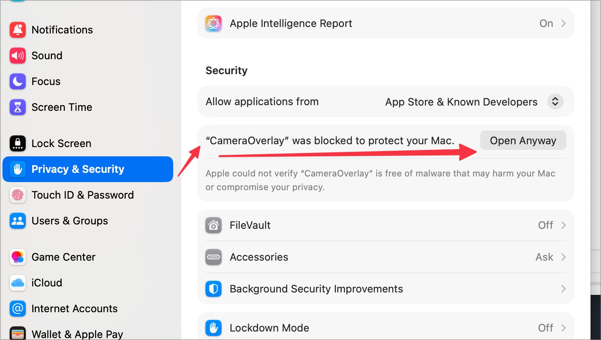

# Camera Overlay

**A floating webcam bubble for your screen recordings. Free, open source, native macOS.**

You know the little circle with someone's face in the corner of a screen recording? That's this. Camera Overlay puts your webcam in a clean, resizable bubble that floats above everything else, so you can record a tutorial, a bug report, or a quick walkthrough and still be *in* it.

No account. No subscription. No cloud. It lives in your menu bar, weighs under 2 MB, and does one thing well.

<p align="center">
  <a href="https://github.com/FreelancerAbir/Camera-Overlay/releases/latest/download/CameraOverlay-1.1.dmg"><b>⬇️ Download Camera Overlay 1.1 (.dmg)</b></a>
  &nbsp;·&nbsp;
  <a href="https://github.com/FreelancerAbir/Camera-Overlay/releases/latest/download/CameraOverlay-1.1.zip">.zip</a>
  &nbsp;·&nbsp;
  <a href="https://github.com/FreelancerAbir/Camera-Overlay/releases">All releases</a>
</p>

Requires macOS 13 Ventura or later. Apple Silicon and Intel.

---

## Install in 30 seconds

1. **Download** the `.dmg` using the button above and open it.
2. **Drag `Camera Overlay` onto the `Applications` folder** shown next to it. That's the install.
3. Eject the disk image and open **Camera Overlay** from your Applications folder (or Spotlight).

### "Apple could not verify CameraOverlay is free of malware"

You'll see this the first time. It is not a virus warning about this app specifically. macOS shows it for every app that isn't notarized through Apple's paid developer program, and this is a free, independently built app. It is safe to open. Pick either way:

**Way 1: System Settings (no Terminal)**

1. In the dialog, click **Done** (not *Move to Trash*).

   

2. Open **System Settings → Privacy & Security** and scroll down to the **Security** section.
3. Right under "Allow applications from" you'll now see *"CameraOverlay" was blocked to protect your Mac*. Click **Open Anyway**, then confirm with your password or Touch ID.

   

The **Open Anyway** button only appears *after* you've tried to open the app and clicked Done, and it stays for about an hour. If you don't see it, open the app once more and check again.

**Way 2: One line in Terminal**

```sh
xattr -d com.apple.quarantine /Applications/CameraOverlay.app
```

This removes the "downloaded from the internet" flag, and the app opens normally from then on.

Either way, you only have to do this once. (On macOS 15 and later, right-clicking the app and choosing Open no longer bypasses this.)

Then allow **Camera** access when asked. If you want to record, you'll also be asked for **Screen Recording** (and **Microphone**, for your voice). After granting Screen Recording, macOS sometimes needs the app to be reopened once.

---

## What you get

**A bubble that looks the way you want.**
Circle or rounded rectangle. Adjustable corner radius, a colored ring (or none), a soft shadow (or none). Drag it anywhere. Resize from the edges. Double-click to snap back to the default size.

**Framing that stays on you.**
Zoom in, nudge left or right, up or down, mirror the image. Or switch on **face tracking** and let the bubble gently follow you as you move. Everything runs on-device with Apple's Vision framework. Nothing leaves your Mac.

**Built-in screen recording.**
Hover over the bubble and a small control bar appears underneath:

| Button | What it does |
|---|---|
| **Full Screen** | Expands your camera to fill the whole screen. Click again (or double-click the camera) to shrink back. Handy for an intro or a sign-off. |
| **Record** | Starts recording your entire screen, bubble included, right away. |
| **Countdown** | Same as Record, but gives you a 3, 2, 1 inside the bubble first so you can get ready. |
| **Pause / Resume** | Pauses the recording. Paused time is cut out of the final video, not frozen in. |
| **Stop & Save** | Finishes the recording and saves it to `~/Movies/Camera Overlay/`, then shows it in Finder. |
| **Hide** | Hides the bubble and switches the camera off. Bring it back with **Show Camera** in the menu bar. |

Recordings are `.mov` files at your display's native resolution, 30 fps, H.264, with microphone audio on macOS 15 and later. The control bar itself is never captured.

While recording, the menu bar icon turns red and the menu gains **Pause Recording** and **Stop Recording & Save**, so you can stop even if you've hidden the bubble.

**Stays out of your way.**
Menu bar only, no Dock icon. The bubble never steals focus from the app you're working in. Hide it and the camera is fully released: no light, no background CPU. Optional launch at login.

**Works with your existing tools.**
The bubble is visible to OBS, QuickTime, Zoom, Loom, and any other screen capture. Use it with whatever you already record with.

---

## How to use it

- Click the **camera icon** in the menu bar to show or hide the bubble, open **Settings**, or quit.
- **Drag** the bubble to move it. **Drag an edge** to resize. **Double-click** to reset the size.
- **Hover** over the bubble for Full Screen, recording controls, and a Hide button.
- **Settings** opens a window with everything: camera device, resolution, frame rate, shape, look, framing, and face tracking. Changes apply live.

---

## Privacy

Camera Overlay has no network access at all. It is sandboxed by macOS, and the only things it can touch are your camera, your microphone (while recording), and your Movies folder (to save recordings). Face tracking runs entirely on-device. There are no analytics, no accounts, and no telemetry.

---

## Build from source

You'll need Xcode 15 or later.

```sh
git clone https://github.com/FreelancerAbir/Camera-Overlay.git
cd Camera-Overlay
open CameraOverlay.xcodeproj
```

Press **Run**. To produce the `.dmg` and `.zip` that get attached to a GitHub release:

```sh
Tools/make_release.sh   # writes to dist/
```

The app is written in Swift with AppKit, SwiftUI, AVFoundation, Vision, and ScreenCaptureKit. No third-party dependencies.

---

## Contributing

Found a bug, or want a feature? Open an issue. Pull requests are welcome. Keep changes focused and describe what you tested.

## License

MIT. See [LICENSE](LICENSE). Made by [Abir Molla](https://github.com/FreelancerAbir).
